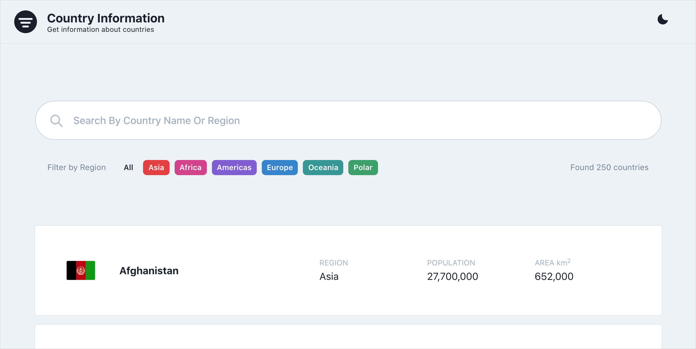

### 
#### 

# Country Information

Get information about countries via a RESTful API



## Development

```
$ git clone https://github.com/egriboz/rest-countries.git
$ yarn
$ yarn dev
```

This will serve the files at `http://localhost:3000/`

### Todo

- [x] Dark mode
- [x] Region filter
- [ ] Borders country 
- [ ] Detail page style fix
